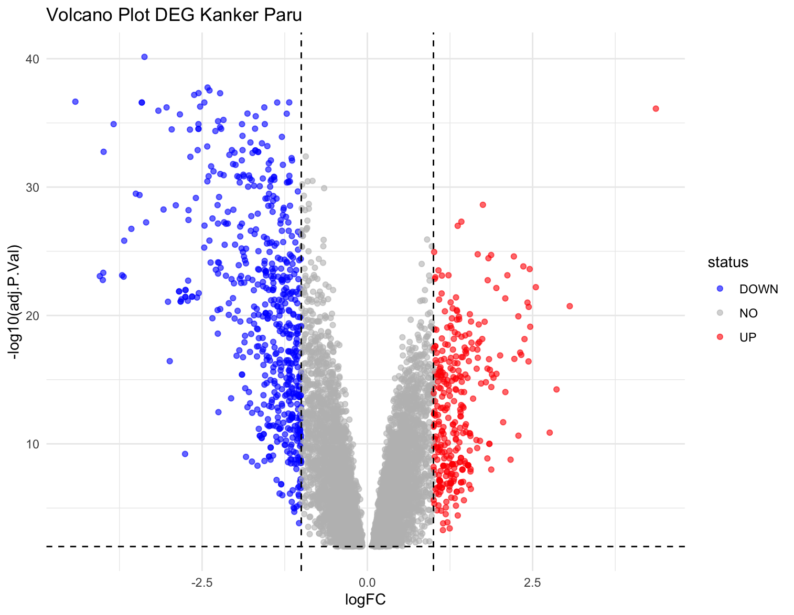
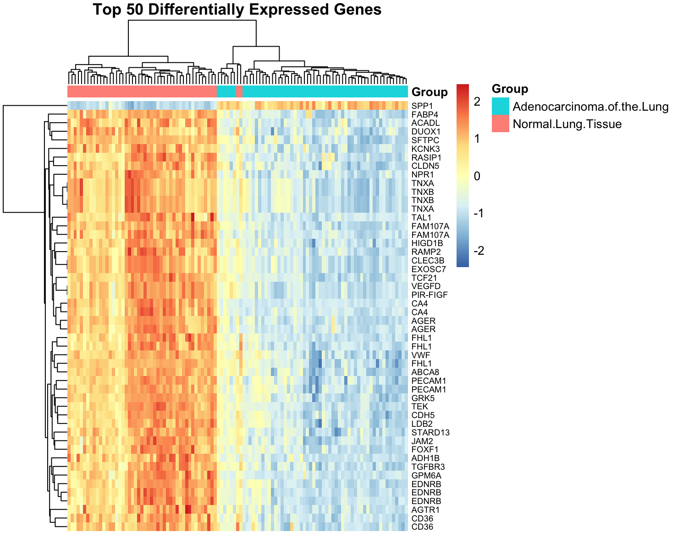
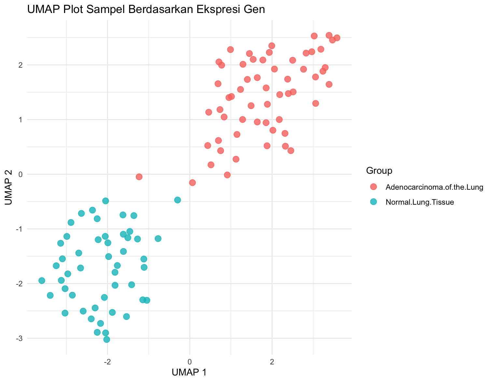
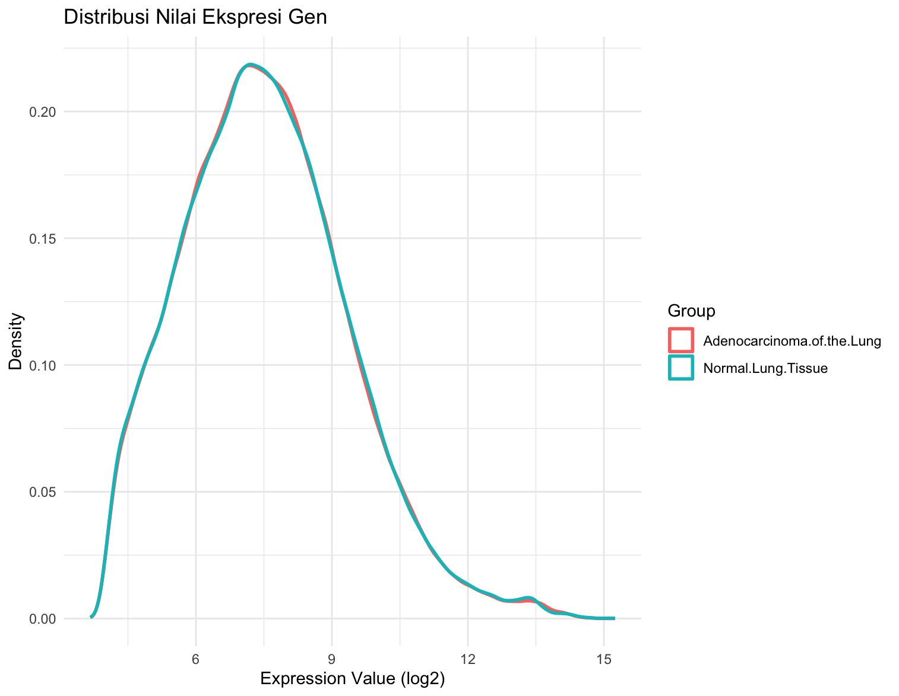
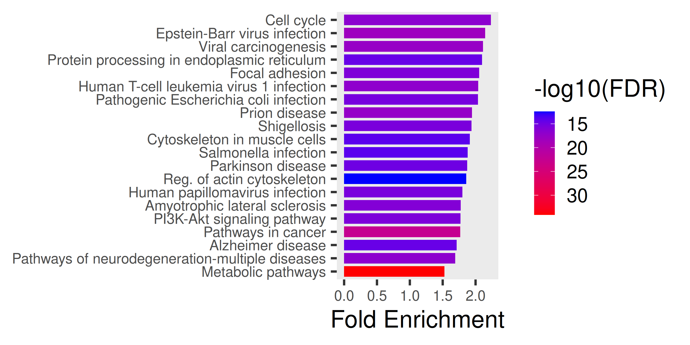
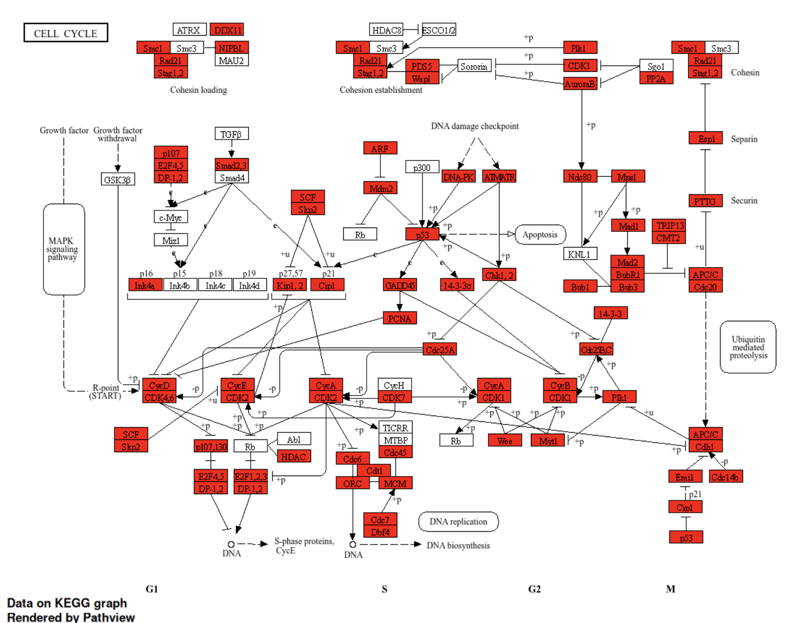

**Judul:**   
Gene expression signature of cigarette smoking and its role in lung adenocarcinoma development and survival

**Pendahuluan**  
Kanker paru merupakan penyebab utama kematian akibat kanker di seluruh dunia dan sekitar 90% kasusnya berkaitan dengan kebiasaan merokok. Meskipun hubungan epidemiologis antara merokok dan kanker paru telah diketahui, perubahan molekuler spesifik pada jaringan paru yang diinduksi oleh paparan asap rokok hingga berkontribusi pada perkembangan kanker serta memengaruhi kelangsungan hidup pasien masih belum sepenuhnya dipahami. Penelitian ini menyoroti pentingnya analisis ekspresi gen untuk mengidentifikasi mekanisme biologis yang mendasari karsinogenesis paru akibat merokok, khususnya pada adenokarsinoma paru sebagai subtipe histologis yang umum ditemukan baik pada perokok maupun non-perokok.  
Tujuan dari penelitian ini adalah untuk mengidentifikasi gen-gen yang ekspresinya berubah akibat paparan rokok di jaringan paru, serta menentukan gen dalam *signature* tersebut yang berperan dalam perkembangan adenokarsinoma paru dan luaran klinisnya. Untuk mencapai tujuan ini, dilakukan analisis ekspresi gen menggunakan *microarray* pada sampel jaringan tumor dan non-tumor dari perokok aktif, mantan perokok, dan individu yang tidak pernah merokok, diikuti dengan seleksi gen menggunakan kriteria statistik ketat, analisis fungsional, serta validasi pada sampel independen. Pendekatan ini diharapkan dapat menganalisis perbedaan ekspresi gen antara jaringan adenokarsinoma paru dan jaringan paru normal untuk mencari kandidat biomarker.

**Metode**
* Platform: Microarray Affymetrix HG-U133A (GPL96).  
* Anotasi Gen: Mapping dari ID Probe Affymetrix ke nama gen (Gene Symbol) menggunakan database hgu133a.db.  
* Statistik: Penerapan koreksi *False Discovery Rate* (FDR) dengan p-value \< 0.01.  
* Studi Kasus Medis: Memahami aplikasi transcriptomics dalam riset penyakit kanker.

**Hasil dan Interpretasi**  
Beberapa gen mengalami *upregulation* dan *downregulation* yang disajikan dalam volcano plot sebagai berikut.  

Terdapat 50 *Differentially Expressed Genes* (DEGs) teratas yang ditampilkan dalam bentuk heatmap sebagai berikut.  

Visualisasi UMAP dan distribusi nilai ekspresi gen pada pasien kontrol dan penderita kanker adalah sebagai berikut.  

Analisis Lanjutan Menggunakan ShinyGO versi 0.85.1

* KEGG Pathway

**Kesimpulan**  
Berdasarkan hasil analisis diketahui bahwa gen NEK2, TTK, TOP2A, KIF15, C10orf3, BUB1, FXR1, dan DKFZp667G2110 dapat digunakan sebagai biomarker bagi deteksi penyakit adenokarsinoma paru. 
